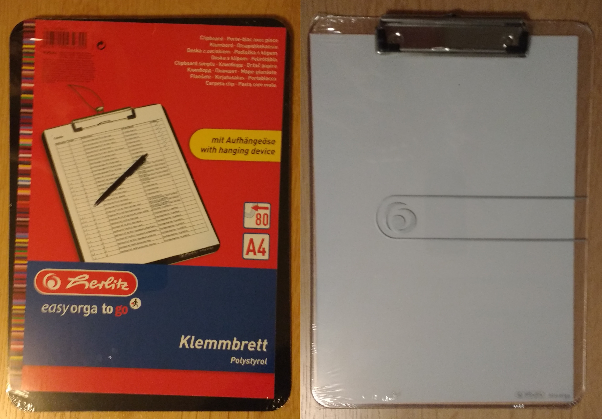
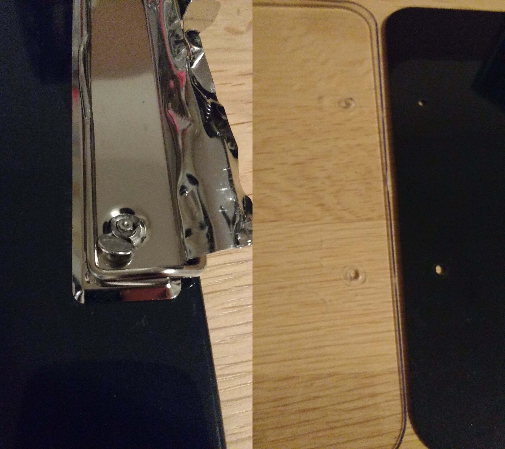
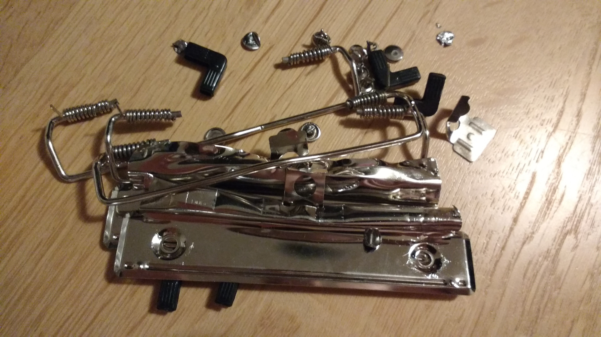
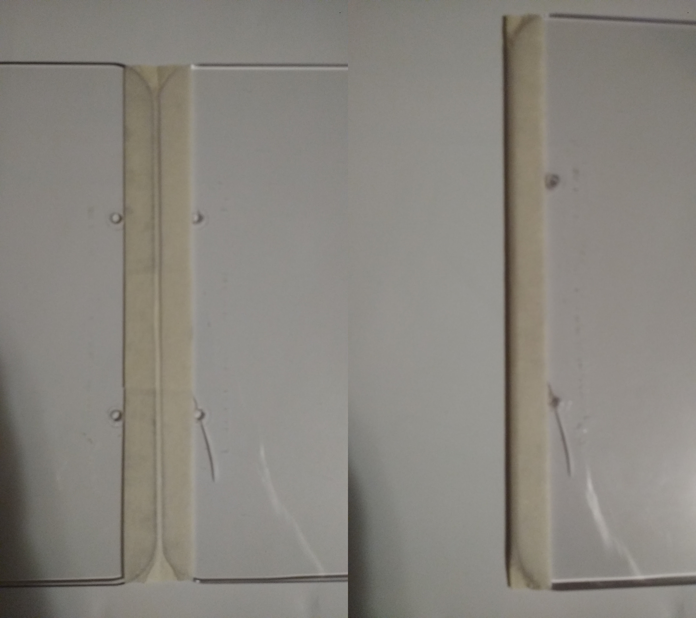
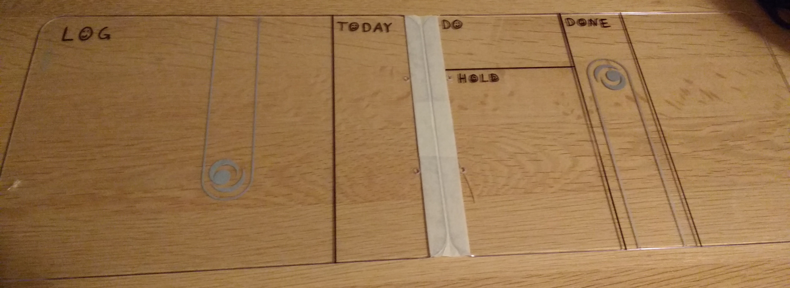

One of my highlights at this year's [SoCraTes in Soltau](https://www.socrates-conference.de/) was a session about Personal Kanban hosted by [Raimo](https://twitter.com/rradczewski/) and [Jan](https://twitter.com/janernsting/).
They shared their experiences, practises and highlighted the advantages of a physical board.
We even got provided material to build our own Personal Kanban boards. Mine looked like this:

While it was really neat that you could start using it right away, I felt the need to have a more durable board to really start utilizing it.
The solution was simple:

## [MORE PLASTIC!](https://youtu.be/7W33HRc1A6c?t=350)

During the session I already had the idea, that my old plastic clipboard would be the perfect board material. The plastic is really smooth and sticky notes just, well, *stick*.

This week I made it to a stationery shop in Hamburg and bought some more transparent and black clipboards:

With some skill, tools and the right amount of force you can remove the clipboard part:

It goes faster after the second bolt, since you know how much force you can apply without damaging the plastic board. Still I cracked one of the transparent boards slightly. Be careful!

## Tools used

* A flat screwdriver to pry open the bolts
* A strong pincer to destroy and remove the bolts
* Adhesive tape to join 2 boards
* Scissors to cut the tape
* A ruler for drawing lines
* Black / white permanent markers

## Actually composing the board

The hard part is over, the rest is just joining and labeling the board.

If you put two of those boards back to back, you get a laptop-ish clamshell design. You need to keep a gap when joining the two boards, so they stay foldable:

After drawing the sections and labels:

## Result

My girlfriend liked the board so much, I needed to craft an additional one:

Applying some stickers lying around (I do not like putting them on laptops):

Costs:

* Money: 9.60 € for 2 plastic clipboards, 4.30 € for a new adhesive tape reel, 7.50 € for the two (black + white) permanent markers. So ca. 30 € for two Personal Kanban boards, ca. 11 € per board if you consider the amount of tape / ink used.
* Time: ca. 40 minutes for the transparent board with black permanent marker (incl. learning how to remove the board clips), ca. 1 hour for the black board with white permanent marker (be careful with the ink, it can get really messy!)

Of course, the best result is that I actually apply Personal Kanban now! :)

## Update 2022-05-23

Today, I broke my board in a ~~boating~~ electrical standing desk accident.
The front half is still somewhat usable thanks to the stickers which prevented further splintering.

