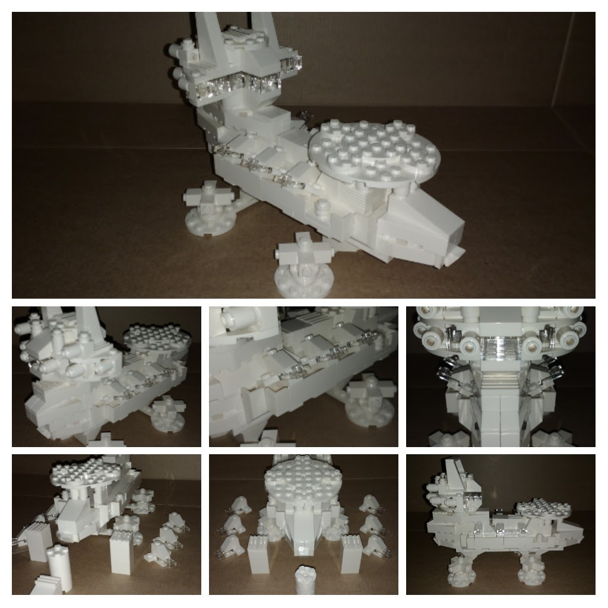
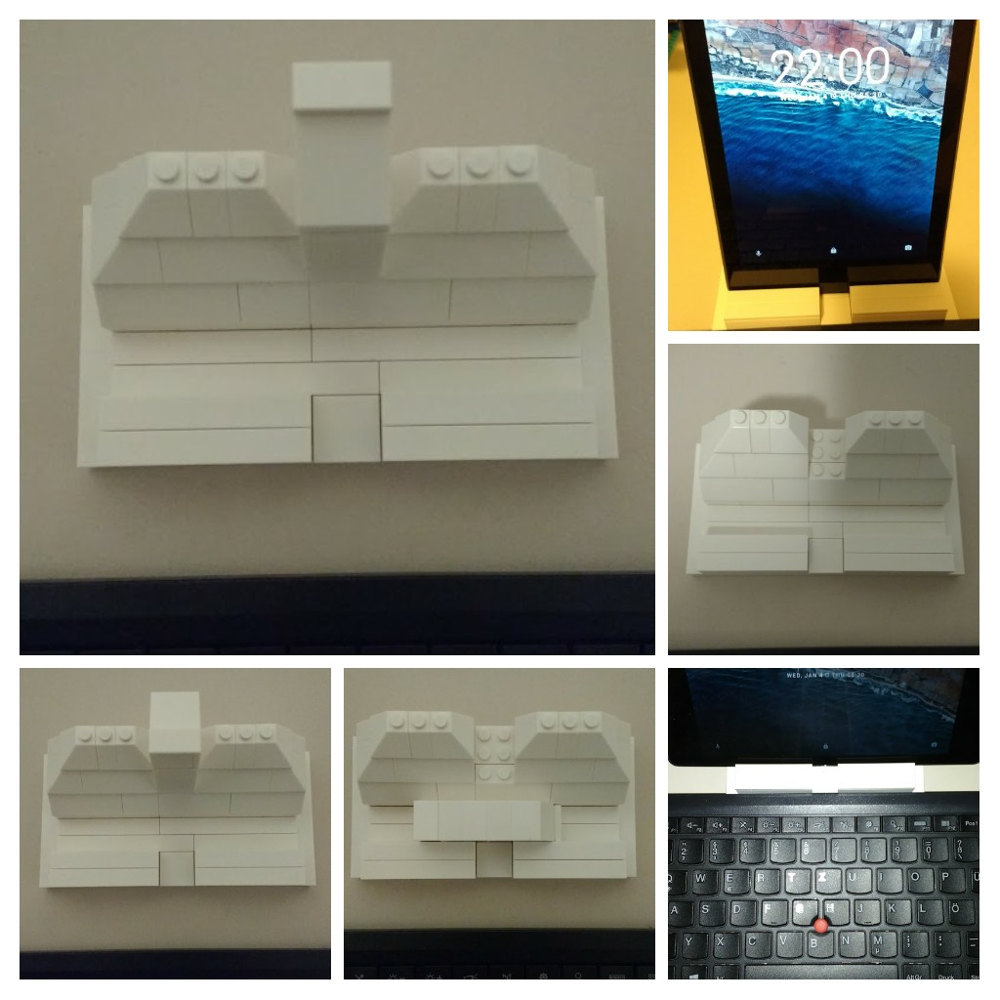

...and I could not resist building a drone carrier!

At first I was sceptical: The set is overpriced, yielding only white and transparent bricks, no special functional parts (e.g. joints/hinges) etc.

My better half ordered the set anyway and I found those limits inspiring. While she built a house, I wanted something *practical*. Like a drone carrier for world domination, you know?

The bricks also make a nice tablet stand:

;)

