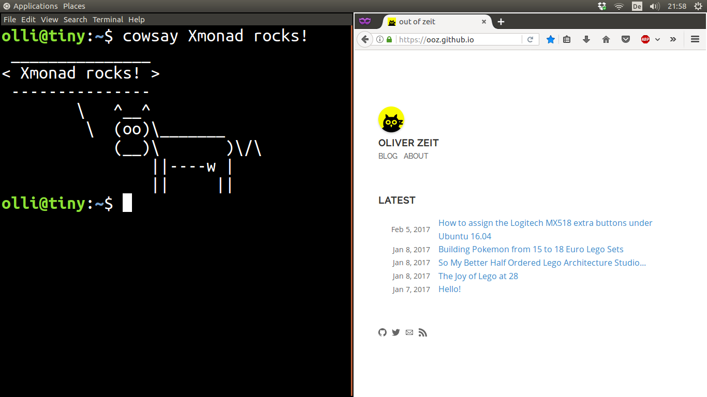

In the last six months I must have set up my default Ubuntu 16.04 + Xmonad desktop environment on like four or more machines.
The goal looks like this (I like to have the top bar for status and widgets):



Here is a small guide for future reference:

## Step-by-step Guide

1. Install the Xmonad package:

    ```bash
    sudo apt install xmonad
    ```

    At this point you can already select an Xmonad session at the login screen.
    But this is not recommended.

2. So additionally you should install the [`gnome-session-xmonad` package](https://github.com/Gekkio/gnome-session-xmonad):

    ```bash
    sudo add-apt-repository ppa:gekkio/xmonad
    sudo apt-get update
    sudo apt-get install gnome-session-xmonad
    ```

3. Configure Xmonad. The Xmonad configuration is written in Haskell. If you are uncertain or need something working to start from, you are free to take [my configuration](https://github.com/ooz/olli/blob/master/.xmonad/xmonad.hs). Place it here: `~/.xmonad/xmonad.hs`

4. Relog and choose the **GNOME + XMonad** session at the login screen.

5. If you dislike the bottom panel (like I do, see above screenshot), you can disable it with:

    ```
    dconf write /org/gnome/gnome-panel/layout/toplevel-id-list "['top-panel']"

    ```

    To redisplay it, execute:

    ```
    dconf write /org/gnome/gnome-panel/layout/toplevel-id-list "['top-panel','bottom-panel']"
    ```

Have fun!

## Update 2021-09-14

The above guide also works for Ubuntu 18.04 and 20.04.
However, for version 20.04 further tweaks are needed:

1. Fix layout switch (Super+Space):

    The shortcut is claimed by GNOME and needs to be disabled in "Settings > Keyboard Shortcuts > Switch to next input source"


2. Remove the Terminal title bar:

    ```
    sudo apt install gnome-shell-extension-pixelsaver
    gnome-extensions enable pixel-saver@deadalnix.me
    gsettings set org.gnome.Terminal.Legacy.Settings headerbar false
    ```

    Source: https://askubuntu.com/questions/1230157/how-to-remove-title-bar-from-terminal-on-the-new-ubuntu-20-04

3. Hide desktop icons:

    Inspired by: https://askubuntu.com/questions/1230877/how-to-remove-home-folder-icon-from-desktop-in-ubuntu-20-04 (the keys however don't work for `GNOME + XMonad` session). Correct key:

    ```
    gsettings set org.gnome.gnome-flashback.desktop show-icons false
    ```

4. Dark theme:

    It's called 'Yaru-dark' (default is 'Yaru', a light theme) and can be set under `org.gnome.desktop.interface.gtk-theme`.

5. Chromium snap context menu

    For me, context menu (e.g. right click on links) didn't work with the new Chromium snap.
    The solution is to [disable hardware accerlation](https://askubuntu.com/questions/1315914/chrome-chromium-context-menu-lag).

6. [If top Gnome Panel disappears randomly on login](https://github.com/Gekkio/gnome-session-xmonad/issues/14#issuecomment-663922710):

    ```
    gsettings set org.gnome.gnome-flashback root-background true
    gsettings set org.gnome.gnome-flashback desktop false
    ```

## Update 2023-03-26

Today, I upgraded two machines from Ubuntu 20.04 to 22.04 without any problems or need for tweaks.
The `Gnome + Xmonad` session just works.

