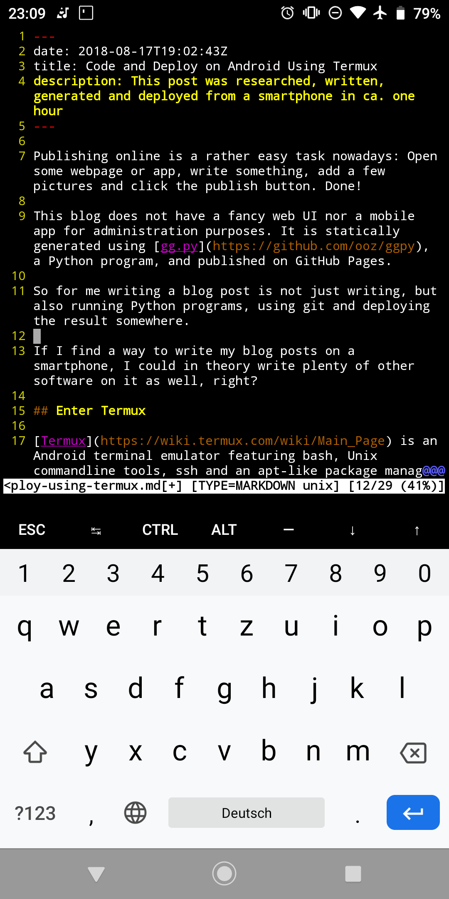

Publishing online is a rather easy task nowadays: Open some webpage or app, write something, add a few pictures and click the publish button. Done!

This blog does not have a fancy web UI nor a mobile app for administration purposes. It is statically generated using [gg.py](https://github.com/ooz/ggpy), a Python program, and published on GitHub Pages.

So for me writing a blog post is not just writing, but also running Python programs, using git and deploying the result somewhere.

If I find a way to write my blog posts on a smartphone, I could in theory write plenty of other software on it as well, right?

## Enter Termux

[Termux](https://wiki.termux.com/wiki/Main_Page) is an Android terminal emulator featuring bash, Unix commandline tools, ssh and an apt-like package manager (incl. vim, git, Python etc.)

After [configuring the keyboard](https://wiki.termux.com/wiki/Touch_Keyboard) and [downloading my dotfiles](https://github.com/ooz/olli), writing a blog post in vim looks like this:

The wiki also contains useful instructions on [how to access local files on your phone from inside Termux](https://wiki.termux.com/wiki/Internal_and_external_storage).

## Peace of mind

Developing on a proper PC, with a proper keyboard is way faster and comfortable, of course.
Knowing that I do not just have access to the Internet on my phone, but that I could also actively shape it, lets me travel more comfortably without worrying too much about bringing a laptop. :)

