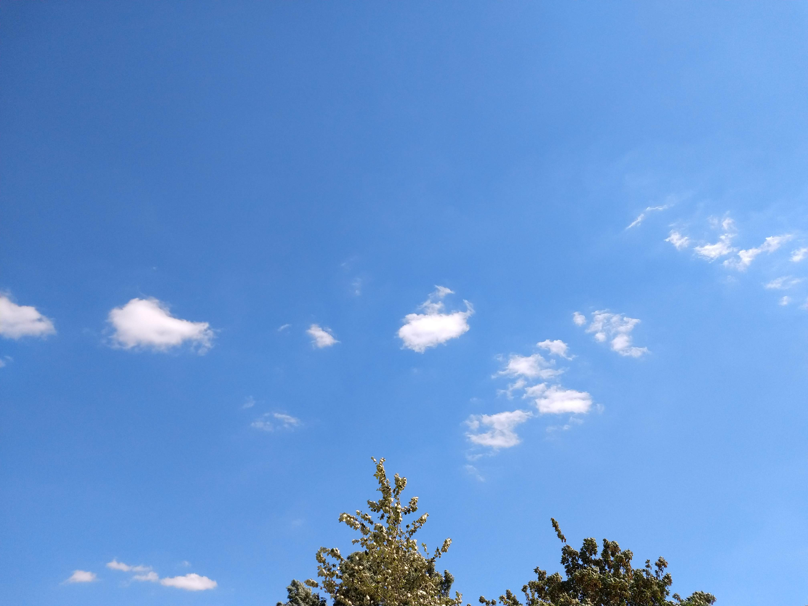

Despite all the negative effects of Corona, I prefer to appreciate the novel experiences.

## Corona skies

The European airspace is one of the most utilized on earth.
Thus it is rare to look up the sky and not see any condensation trails.

Now, living in a city with a nearby airport, we have *Corona skies*, which I would define as:

> The natural sky either clouded or cloudless without any signs of human flight.

## Dystopian malls

Whenever getting supplies, there are recorded public announcements playing.
The content always boils down to:

1. Mind the *government* Corona *laws*
2. Stay *safe and healthy*
3. Enjoy and *keep shopping*

Which perfectly aligns with any dystopian story ever.

