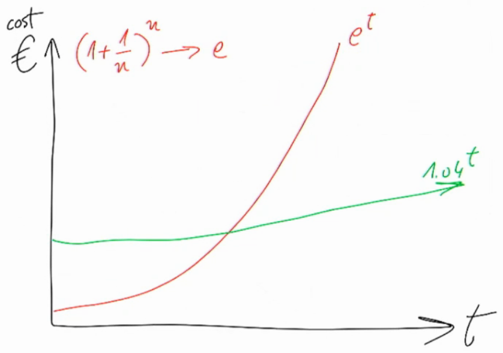

On Oct 1st 2020 [DATEV hosted an online meetup](https://ti.to/scc-datev/jbrains/en) with [J. B. Rainsberger](https://www.jbrains.ca) ("JBR" for the rest of the post) condensing two of his workshops/talks into 1.5 hours.
While I missed the first ten minutes of the talk (first argument?), the rest was still very interesting and spot-on!

## Cost of Software Development Practices

JBR started with how to communicate the benefit of good software development practices to managers and co-workers. To accountants, he'd recommend the goal of evolutionary design as:

> "Reduce the volatility in the marginal cost of features" - JBR

which basically means that good practices make software development cost more predictable, easier to account for.

He illustrated this with two exponential functions (all three diagrams drawn by JBR, shot&amp;cropped by me). In Fig. 1:

1. Red curve describing ad-hoc design, spaghetti code, few/no tests, no refactoring etc.
2. Green curve following good software development practices like agile, evolutionary design, TDD etc.

JBR acknowledged that software development cost always follows exponential functions.
He motivated the base of the red exponential function *e* (Euler's number) with technical debt accumulating like compound interest. Good practices result in a lower base and higher initial costs.


[Fig. 1: cost of software development practices (green good, red poor).]

There's a point in time where the accumulated cost approaches will cost the same amount of money (t0). Past this point, the project cost of evolutionary design is cheaper.

(Fig. 2: t0, time of equal project cost.)

At some further point in time, "project heat death" is reached: Change becomes too expensive and a rewrite is favored (Fig. 3). The goal of any good development practice should be to

* have t0 as early as possible and to
* delay project heat death as long as possible.


[Fig. 3: project heat death occurs when cost of change is unreasonably high.]

On the contrary, spaghetti software development may still be favored by managers if they gamble on the project dying before t0. Then the big question is: Do managers account for this consciously?

## From Waterfall to TDD to Lean Startup

The last part was about transforming any waterfall-ish development process into the ideal *lean startup* (LS) by introducing feedback loops, repeatedly cutting feedback loops in half and as a result moving process throughput from micro-level "working code" to organization-level "money/revenue". JBR referred to foundations in queuing theory.

Citing the [infamous and greatly misunderstood W. W. Royce paper from 1970](http://www-scf.usc.edu/~csci201/lectures/Lecture11/royce1970.pdf), JBR reminded the audience, that the Waterfall model was said to only ever work for straight-forward projects. Even in the original concept, it was described as risky and prone to failures (p. 2, s. 1).

To improve the Waterfall concept of

```
R --v               # Research / Requirements / Analysis
   D --v            # Design
       C --v        # Code
           T --v    # Test
               M    # Maintenance / Ops
```

One could first introduce the feedback loop of test-first programming (TFP) iterating between code and tests. The throughput of this feedback loop is working code. The Waterfall then becomes

```
R --v
   D --v
       TFP --v
             M
```

Iterating between design and TFP using refactoring is essentially test-driven development (TDD), producing well-designed and working code. This replaces another part of the Waterfall

```
R --v
   TDD --v
         M
```

Continuing the pattern and looping between requirement analysis and TDD, the process becomes behavior-driven development (BDD). The throughput becomes well-designed, working code which fulfills business needs. JBR suggested "talk to me in examples" to inquire requirements of stakeholders. The Waterfall shrinks to a puddle:

```
BDD --v
      M
```

Looping feedback between BDD and maintenance/operations results in continuous delivery (CD). Eventually the throughput becomes real value: money/revenue. Further shortening the feedback cycles, CD becomes the ideal LS ("cash in my pockets sooner" - JBR).

```
CD --shorter cycles--> LS
```
