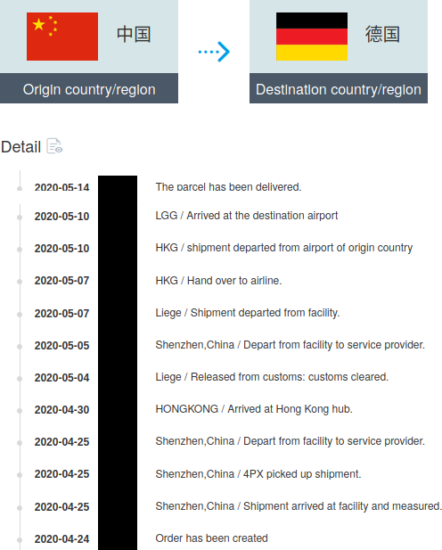
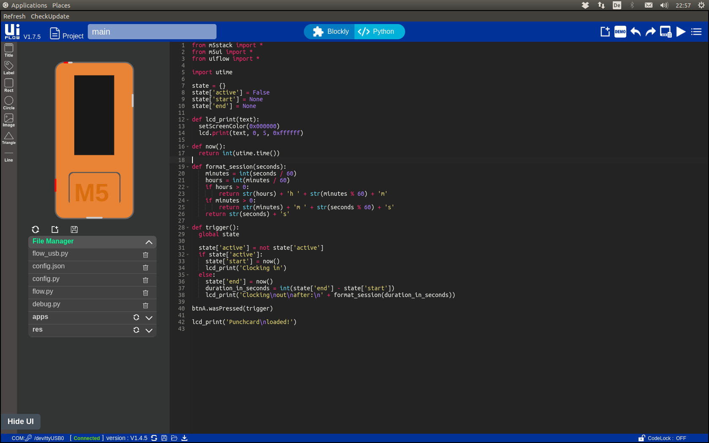

Having worked in home office mode for a few months before the Corona pandemic hit, I felt like spending way too much time working without knowing, how long I actually work each day.

Being on flexitime and 40h/week, I often felt like needing to compensate for small breaks or distractions.
So I wanted a proper time tracking solution.

## Requirements

* Simple start/stop user interface
* Track work time per day and per week
* Data is saved in a simple format
* Tool may be used for project-based time tracking

Ideally, I wanted a separate single-use device (smartphone/web browser ruled out) with a start/stop button and a small display.

## Consumerist Detour

Instead of writing the program first, [I went shopping for a device which suited my interface needs](https://shop.m5stack.com/products/stick-c). In the midst of the pandemic:



After toying around with the device for an evening, digging through part-English, part-Chinese documentation, eventually setting up UiFlow, connecting the device and getting a simple visually programmed (but wrong) program to run... I put the project to rest.

## The Solution

However, the time tracking problem didn't magically disappear, so a few weeks ago I solved it with a [simple Python script](https://github.com/ooz/olli/blob/master/.scripts/punchcard.py).

Executing the script starts the timer:
```
$ punchcard.py
Clocking in at  2021-05-29 23:08:56.477436
```

Terminating the script prints time worked in the current session, today and for the week:

```
^C
Clocking out at 2021-05-29 23:09:29.253941 (after 32s)
Today: 32s
This week: 32h 16m
```

Every five minutes it prints the time tracked so far. All data is saved in the hidden file `.punchcard.csv` in current directory. The format is the date followed by seconds tracked that day:

```
DATE,SECONDS
2021-05-29,32
```

The printed output and simple format also makes it easy to correct wrongly tracked time (e.g. when forgetting to start/terminate the script). Time may be tracked for different projects, even in parallel by starting the script in different (project-specific) directories, in separate terminals or as background processes.

## Lesson Learned

The script works and the "separate, single-use device" became a separate virtual desktop with just the time tracking terminal.

Recently, I fetched the M5StickC again and tried to port the program to [MicroPython](https://docs.micropython.org/en/latest/esp32/quickref.html), which uses Python 2 syntax and has less batteries included (e.g. no high-level datetime package). I ended up with a stripped-down version of the punchcard script, a simple stopwatch:



UiFlow is nice for exploring the device API and supplied widgets, since you can compose some visual program using all desired features (e.g. sensors, UI components) and then inspect the generated Python code (however, you can't freely switch between the views: the program/source gets reset!)

Ultimately, I didn't put more effort in the ESP32 microcontroller solution, because the script already covers my needs. Writing the script and doing some research first would have saved me ~15 €, but I still learned something tinkering around with the device.