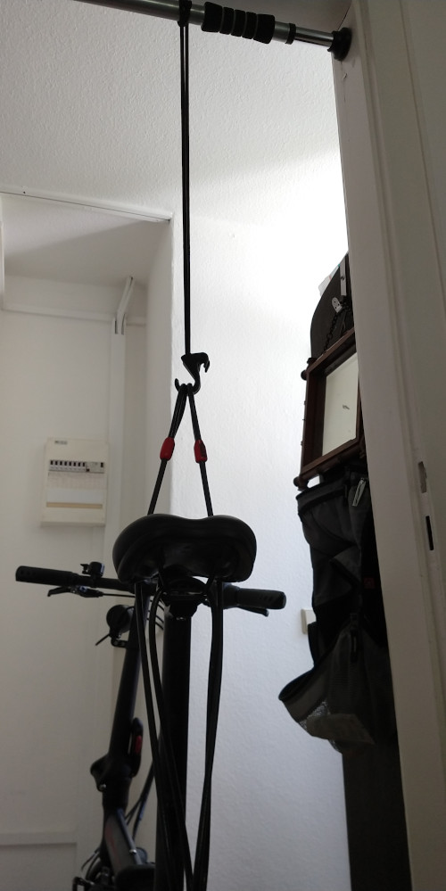

Originally, I wanted to write on something else, but I'm taking the opportunity to continue my AI-generated, bullshit bingo post title streak. Documenting my engineering feats for future personal reference.

## Problem and Idea

Last year, someone placed (lost?) nail(s?) on a bicycle lane.
I was lucky enough to need to replace both inner tube and wheel mantle...

Reassembling the rear wheel, I probably didn't tighten the nuts enough,
so the rear axle continuously pushed further into the frame due to road bumps o.s. (see upper sketch).
Resulting in the chain losing tension and jumping of the cogs all the time (to the point, the bicycle basically can't be used).

(Black: frame, blue: chain/pedal axle, red/dark green: rear axle)

My idea was to lift the bike, loosen the nuts, so gravity pulls the rear wheel down till the chain has proper tension (lower image). Then *thoroughly* tighten the nuts.

There are special "tripods" for bicycles to lift and maintain them.
Since I have none and don't intend to get one, I DIY'd it.
Alternatives include going to a self-service bike workshop, pay a small fee and use the equipment there.

## Behold, *der Gerät*

(Routing the steel cable around the saddle resulted in a upright position already, spirit level can be used to check)

(Box of recently bought shoes protecting carpeting)

MacGyver score: **5 out of 10**

* Major league rubber band used
* Oil spill prevented, carpeting unharmed
* Swiss Army Knife was in reach, but not needed since proper tools were available
* No evil guys bicycle sabotage conspiracy uncovered
