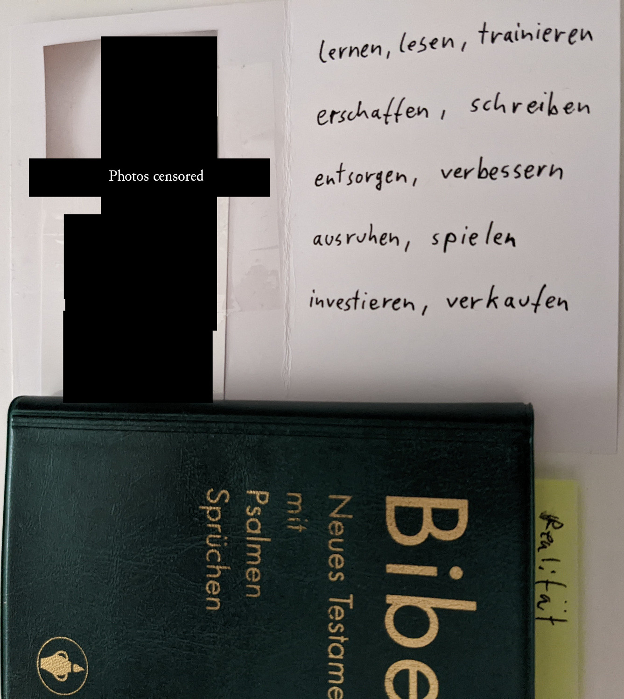

You know what always helped me acting upon the wisdom I read in BOOKs:

*Writing summaries, or cheat sheets*

You can do so even if you haven't read the entire book, yet!
Then you should just put a version or volume number on it, that you can increment when you gain further noteworthy learnings.

## Bible Example

Over the last few years I started reading the Bible (New Testament, in German). So, please ignore the German words, I'll provide a translation for the summarized ones below the photo:



Translation of the German words in the summary, so far:

```
learn, read, train
create, write
get rid of, improve
rest, play
invest, sell
```


