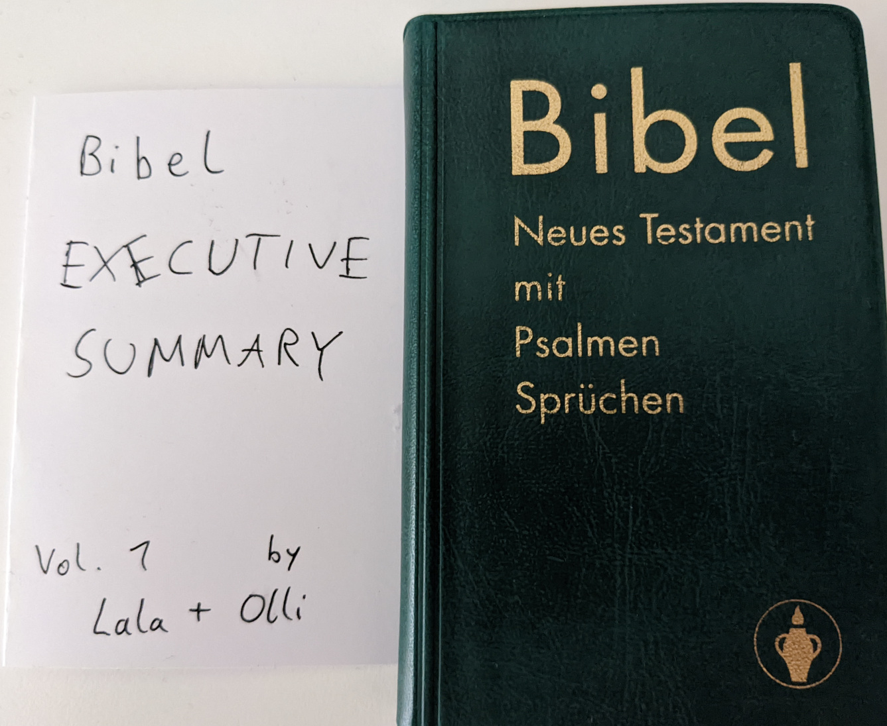
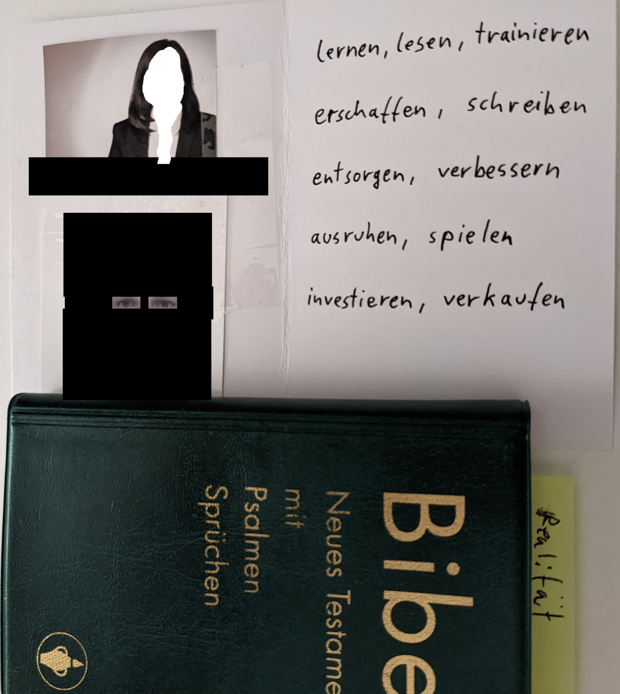

You know what always helped me acting upon the wisdom I read in BOOKs:

*Writing summaries, or cheat sheets*

You can do so even if you haven't read the entire book, yet!
Then you should just put a version or volume number on it, that you can increment when you gain further noteworthy learnings.

## Bible Example

Over the last few years I started reading the Bible (New Testament, in GERMAN by MARTIN LUTHER for MAXIMUM AUTHENTICITY). So, please ignore the German words, I'll provide a translation for the summarized ones below the photo:




(Please excuse poor image quality, I'm not a good photographer, but I hope you get the IDEA)

Translation of the German words in the summary, so far:

```
learn, read, train
create, write
get rid of, improve
rest, play
invest, sell
```

Me following those motives AND LOVING MY WOMÄN LALA, helped me greatly achieving TRUE GREATNESS and PURE LOVE. Hence I pimped up the empty space with pictures of US:

* Lala in her BUSINESS SUIT
* Olli applying for UNIVERSITY, still with military haircut

(censored for privacy reasons)

