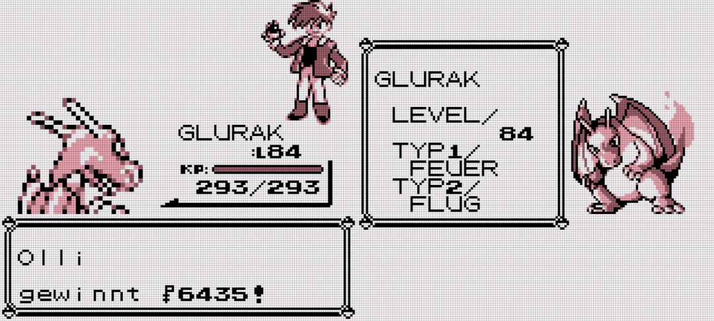
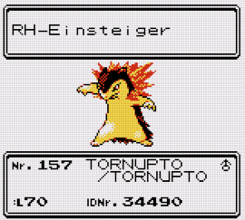

Over the holidays I went through [my stuff™](https://www.youtube.com/watch?v=MvgN5gCuLac) and discovered unfinished Pokemon Sun/Moon (SM, will [abbreviate](https://en.wikipedia.org/wiki/Pok%C3%A9mon_(video_game_series)#Summary_of_main_series_titles) [generations](https://bulbapedia.bulbagarden.net/wiki/Generation) ([German](https://www.pokewiki.de/Spielgeneration)) from here on) for Nintendo 3DS.
I bought it back in 2016, finished like 2/3rd of the main story and and abandoned it.
Now, I somehow felt the need to "finish it" (just beating Elite 4 + Champ and catching the four island "guardian" Fairy type Pokemon). Further exploring the [post game](https://bulbapedia.bulbagarden.net/wiki/Appendix:Sun_and_Moon_walkthrough#Post-Game) didn't appeal to me. Maintaining [affection](https://bulbapedia.bulbagarden.net/wiki/Affection) using ["Pokemon Refresh"](https://bulbapedia.bulbagarden.net/wiki/Pok%C3%A9mon_Refresh) felt like a chore.

By contrast, ORAS, I binged in 3 days from start to Elite 4 + Champ beaten.
Wondering, whether I just "grew old and tired" of Pokemon or whether the games really got worse,
I fired up Pokemon Red again:

No hand-holding, direct action, freedom to explore and a weirdly motivating grind.
Despite non-existent postgame and the difficulty boiling down to "pick starter and press A", *it was fun*.

## What makes a Pokemon game?

First of all, the games stand and fall with cute/strong/interesting and *relatable* Pocket Monsters, duh!
If you can't pick favorites (motivated early with the [starters](https://www.pokewiki.de/Starter-Pok%C3%A9mon#%C3%9Cbersicht) in each generation), the games lose quite some pull.

In interviews, Game Freak confirmed the target audience to be:

* people who are new to Pokemon,
* long-time fans and
* [eSport, pro players](https://www.smogon.com/).

(Of course, they want to cater to everyone and keep raking in [billion$](https://en.wikipedia.org/wiki/List_of_highest-grossing_media_franchises)!)

### The core gameplay

...can be condensed to: *battle*, *catch*, *grow*, *explore*, *connect* and *gimmicks*.
The first five are constants. Gimmicks vary by generation, offering some optional experiments that may not carry over to later installments (e.g. secret base building, Pokemon grooming contests).

### Battle mechanics

Turn-based Pokemon battles are at the heart of all mainline games.
This may be a bit dated by modern standards, but it makes the games very accessible.
To this day, the fundamental mechanics have been established with the first three generations.

**Gen1**:

* [The Pokemon itself with its type and stat distribution](https://pokemondb.net/pokedex)
* Attacks (same-type attack bonus, STAB)
* *[IV](https://bulbapedia.bulbagarden.net/wiki/Individual_values) + [EV](https://bulbapedia.bulbagarden.net/wiki/Effort_values) ([calculator](https://pycosites.com/pkmn/ivcalc_gen2.php))

**Gen2**:

* SpDef
* Dark/Steel types, balancing Psychic type
* Held items
* Friendship o.s.
* Genders and breeding
* Shiny

**Gen3**:

* Abilities
* *Natures
* Multi battles (opening the can of "non-stable" battle features like mega evolution, Z attacks, ...)

Later generations then continued with balancing, [physical/special split](https://bulbapedia.bulbagarden.net/wiki/Damage_category), Fairy type, affection and further minor changes.

All features marked with "*", are not in the interest of the player.
Meaning, the additional play time required to get optimal IV and natures is in no reasonable relation to the strategic benefit of getting a few more viable builds.
So much, that competitive Pokemon play mostly happens on simulators, where you are free to build the desired Mon without any grind.
Recent mainline games are acknowledging this by adding ingame means to [fix IV](https://bulbapedia.bulbagarden.net/wiki/Hyper_Training) and [force natures](https://bulbapedia.bulbagarden.net/wiki/Nature#Synchronize).

### The "story"

Well, it has to be mentioned for completeness' sake:
The MC child (you) and rival(s) head out to explore the Pokemon world, grow and beat bad guys/save world.
Eventually, you'll beat the Pokemon League, Elite 4, champ, catch legendaries and maybe complete the Pokedex.

## Where is it going?

On the pro side, backwards compatibility is unrivaled in the video game industry.
Using paid Pokemon Bank/Home services (attachment has its price!), Gen3 Pokemon (from 2002/2003) can be transferred all the way up to current generation.
Those services also support official emulations of Gen1 and Gen2.

However, recent games lacked quality and substance.
"Pokemon Legends: Arceus" (PLA) is around the corner and it looks like a promising but unpolished experiment,
a glimpse at what Pokemon games could be in the future.

In the meantime, I'll stay comfy in Johto:

