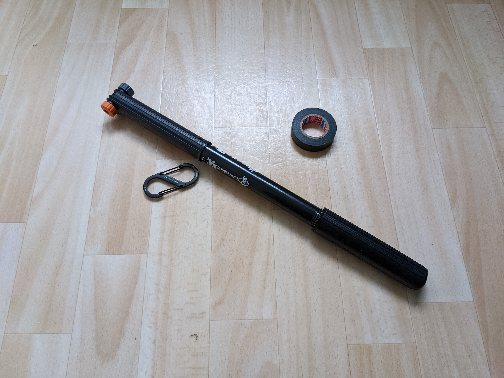
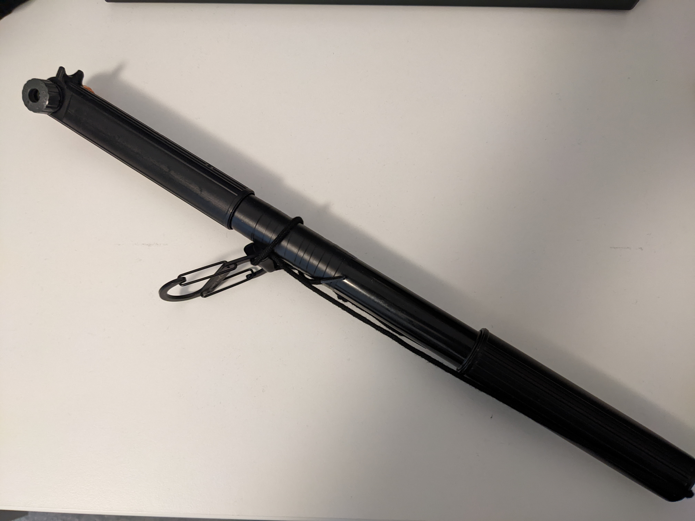
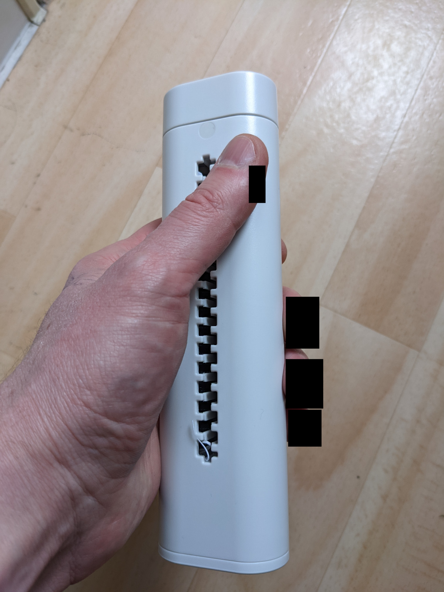

I always thought of myself more of a Jedi, but today I made a Sith lightsaber. Here's how.

## Sith Lightsaber

### Bill of Materials

* Black bicycle air pump
* Black Isolation tape
* Black carabiner
* Black shoe string

### Final Result

With a little imagination, light shoots out of both sides when the pump or the "buttons" are pressed!

### Suitable Sith Ship

https://oliz.io/mocs/spaceships/the-shiv/

(made that recently, you are welcome!)

### Alternative uses

It's still an air pump for bicycles, just remove the shoe string and you can pump your rides!

## Jedi Lightsaber

I got this as a present from my partner. It's from [Muji](https://www.muji.com/):

It's a manual paper shredder, because I always disliked the noise of the electric ones. Safety instructions are on the backside. You turn the handle above, put the paper in and paper scrabs come out at the bottom. Turning the handle feels like turning on a lightsaber! Again, add some black isotape and a loop at the bottom and imagine light coming out of the handle end, voila!

MacGyver score: 8 out of 10

* Isolation tape used
* Light sabers retain their original use-cases of air pumping and paper shredding
* Good for the environment
* No Swiss Army Knife needed, regular scissors are enough
* Balances the force between good and evil folks

