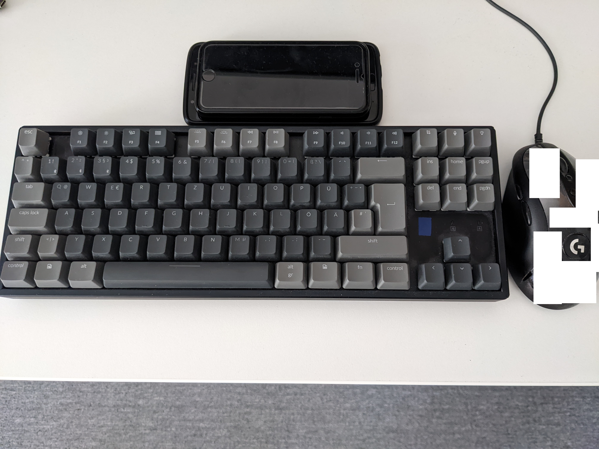

Similar work and introduction:

*NOMEN EST OMEN*
*CARPE DIEM*

*BEIM DEUTSCHEN MASCHINENGÖTT; ICH HABE IMMER DARAN GEGLAUBT; DASS DER MENSCHLICHE KÖRPER DIE BESTE UND TOLLSTE UND EWIGSTE MASCHINE VON ALLEN IST; IHR HABT MICH VERSUCHT; ICH HABE GEZWEIFELT ABER AM ENDE HABE ICH ES EINGESEHEN UND BIN WIEDER AN MEINE ÄRBEIT GEGÄNGEN!*
*TROTZDEM SIND DIE ÄRZTE IMMER NOCH DIE BESTE BAND DER WELT!*

*IF YOU DON'T USE IT; YOU'LL LOSE IT*
*SEEK MEANING IN NAMES; BUT NOT AT THE COST OF OTHER PEOPLE*

*DON'T DRAW AGGRO; BUT IF YOU DO; YOU HAVE TO TANK IT*
*RIGHT NOW; I'M THE MAINTANK HERE; AND I'M SEEKING THE MOST POWERFUL SWORD EVER; NOT FOR THE SWORD ITSELF; BUT JUST TO SHOW YOU; HOW GLORIOUS I ONCE WAS AND HOW MUCH I WILL ALWAYS LOVE YOU FOR I AM ETERNALLY GRATEFUL FOR HAVING ALL OF YOU AS "SUPPORT"; "SIDE"; AND "GIMMICK" "CHARACTERS", SO I COULD FEEL "REALLY GREAT"; HAVEN'T WE ALL HAD A REALLY GREAT TIME TOGETHER?!*

## Greetings Everyone!

Hello everyone,

As you may have read, I think, I have recently attained mastery.

As a lifelong keyboard warrior, I have always appreciated the efficiency, precision and direct access of one of my best tools: The Keyboard.

So, today we are talking about that. Yeah, yeah, of course, I use my mouse, too. But that's a different topic for someone else, really.

## The Keys

Images go long way, they say. I'm not a good photographer by any means, but I sincerely hope, you get the message:

## My Reading of The Keys and The Map

Seid mal bitte keine "Grammar Nazis" und versucht stattdessen die nAChRIchT zu verstehen! DANKE! BIS ZUM NÄCHSTEN MAL!

